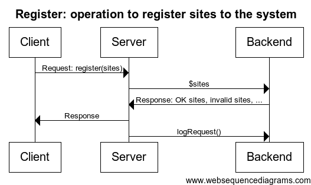
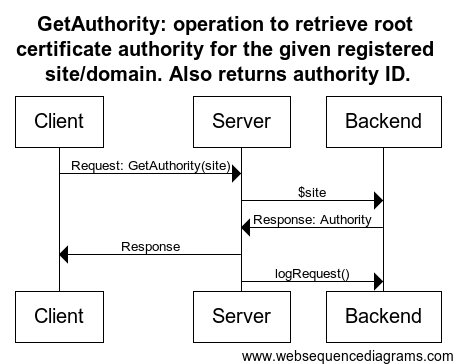
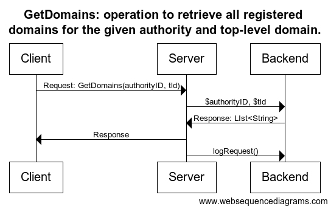

## Informace o projektu

### Zápočtová služba

* [Rozhraní](./../src/org/skycrawl/wsdemo/localservice/controller/AuthorityService.java)
* [Implementace](./../src/org/skycrawl/wsdemo/localservice/controller/AuthorityServiceImpl.java)
* Diagramy jednotlivých operací:

### Externí služba

[IpToGeo](./../src/org/skycrawl/wsdemo/remoteservice/IpToGeo.java)

### Logování požadavků

Vypíše IP, město a zemi, jsou-li jednotlivé informace k dispozici od externí služby. Logování se chová následovně:

* Na OS X otevře jednoduchý dialog s danými informacemi.
* Na ostatních systémech vypíše dané informace na konzoli.
